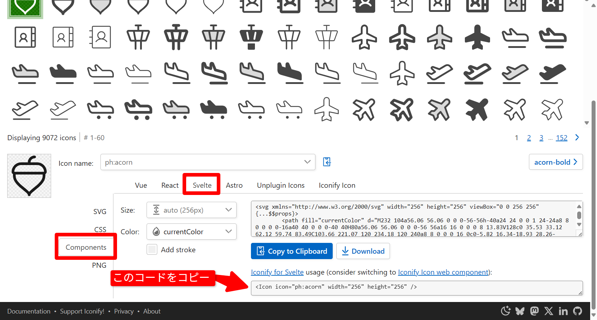

## 開発時のコマンド集
開発時に必要なコマンド・作業の流れを以下にまとめる。

### そもそも話
これから紹介するコマンドたちはフロントエンド開発のためのものである。
フロントエンドで作業してもらうには `/client` フォルダーに移動してもらう必要があるので、きちんとターミナル上で自分がどこにいるのか把握しておくこと。

```bash
cd client
```

### ⚠️注意
github上のデータを取得する `git pull` コマンドを行う時は、 `/akashi_cafe/client` ではなく、 `/akashi_cafe` の位置で行うこと。
`/akashi_cafe/client` から戻るには、ターミナル上で以下を実行する。

```bash
cd ../
```

### 開発サーバーの立ち上げ
これを行うことでSvelteファイルで作成したUIをブラウザ上で確認することが出来る。
そのためには以下コマンドを実行する。
```bash
npm run dev
```

### パッケージの更新
誰かが使用するパッケージを更新した場合、ローカル環境のものも更新する必要がある。
そのためには以下を実行する。
```bash
npm i
```

## 便利なサイト集
### Iconify | Phosphhor Icon Set
[Phosphor icon set \- 9072 open source icons \- Iconify](https://icon-sets.iconify.design/ph/)
UI構築に使うアイコンセット。
使用したいアイコンを検索して、以下画像のようにSvelte用のコードをコピーする。



